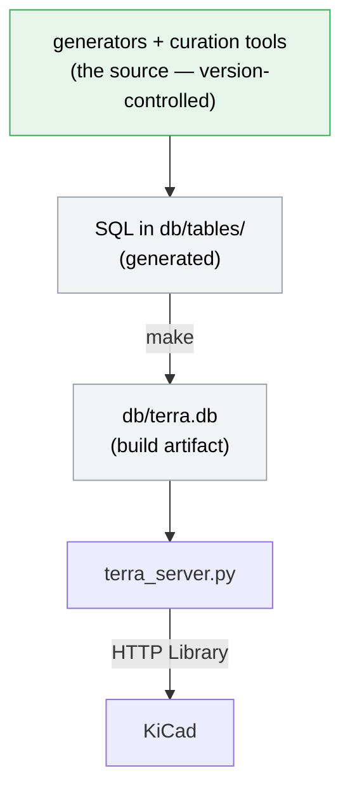

# Terra EDA Library

## What is Terra

Terra is an HTTP-served database component library for KiCad based on parts that
are fully generated by scripts.  Each part is a real, fully-specified, orderable
part — a concrete MPN with its datasheet, parameters, symbol, and footprint — so
that schematic capture places parts that are complete from the start.

Terra aims to be the fully-specified counterpart to KiCad's shipped symbol and
footprint libraries. Those provide the drawing; Terra adds the manufacturer
identity, datasheet (in the case of generic parts), and parameters that make a
part orderable and BOM-ready. Because each part is produced by tools — from
KiCad's libraries and from datasheet and parametric sources — Terra is a
*generator* whose output is version-controlled, not a database you populate by
editing.

The name "Terra EDA Library" was chosen to contrast with the (excellent)
[Celestial Altium Library](https://altiumlibrary.com/). That library is
meticulously hand curated with hundreds of thousands of parts. The assets are
[released on GitHub](https://github.com/issus/altium-library) but the
database--the crucial part--is closed, in the cloud, gated requiring signup and
authentication, with complicated local setup. The symbols, while extensive,
clash with the KiCad symbol style, and do not particularly enhance the Altium
schematic appearance either.

By contrast, Terra runs entirely on your local system, is grounded in the
existing KiCad symbols and footprints wherever possibles, is open to inspection,
modification, correction, and enhancement. If you are inclined, you can easily
roll up your sleeves and get your hands dirty.

## How it fits together



The canonical form of the library is the set of scripts and assets under
`db/tables/*`. These scripts generate SQL table entries that are compiled into
the live database, which is then accessed via the HTTP server.

Version controlled are the generators, the curation assets, and the schema
definitions under `db/schema/`. The per-part SQL the generators emit and the
compiled database are build artifacts, reproducible given the same sources. Every
part has a script — even bespoke one-offs — so that schema changes and convention
switches (US vs. EU symbol styles, for example) are configuration changes
followed by a rebuild, never mass edits. A few legacy parts still live as tracked
SQL files, and those are slated for migration to scripts as well.

The database is a SQLite database served over HTTP, which yields a number of advantages:

- No ODBC driver is needed.  Much simpler operating-system setup and no driver dependency.
- No per-table configuration is needed. Much simpler and less tedious KiCad
  configuration.
- New additions to the library are automatically picked up without extra configuration.
- HTTP libs are lazily loaded which means that your 'add-part' dialog pops up
  quickly, regardless of how large the library grows.

### Why not curate the database directly?

Generating the tables from scripts, even one-off parts, allows:

  1. Quick recreation the database after a schema change.  No stale   tables

  2. Reuse of parameter fields for variant parts with different packages

  3. Quick application of local preferences (package style) by chaning a single setting

## Using the library

To use Terra, you need to 1) build it, 2) serve it, and 3) select parts in
KiCad.

### Prerequisites

- KiCad 8.0+ (9.0+ recommended) — HTTP libraries require 8.0
- Python 3 and [uv](https://docs.astral.sh/uv/)
- make

### Build and serve

```bash
git clone https://github.com/dfnr2/terra-eda-library.git
cd terra-eda-library

make            # build db/terra.db + terra.kicad_dbl from the SQL
make httplib    # write terra.kicad_httplib (one-time)
make serve      # serve the library at http://127.0.0.1:8361/
```

`make serve` runs in the foreground; leave it running while you use KiCad. To
keep it running persistently instead, install it as a background service — see
[PROCESSES.md](PROCESSES.md) (`make install-service`).

### Connect KiCad

1. **Preferences → Configure Paths…** — add `TERRA_EDA_LIB` = the repo path, then
   restart KiCad.
2. **Preferences → Manage Symbol Libraries… → Global Libraries** — **Add**, and
   point the path at `${TERRA_EDA_LIB}/terra.kicad_httplib`. Give it a nickname,
   e.g. `terra`. (`make register-kicad` adds this global-library entry for you;
   you still set `TERRA_EDA_LIB` and restart KiCad yourself.)
3. Press **A** in a schematic — the Terra categories appear, and parts drop in
   fully specified.

The server must be running for the library to load.

## Working on the library

Parts are added and changed by **running or writing generators and curation
tools**. The scripts enforce the invariants that make the library coherent: above
all that each part's `part_locator` (the canonical key used to find substitutes)
is the computed value, and that metadata is complete.

The following are an overview of the process of adding parts, not a how-to
guide.

### Bulk parts

To add bulk parts from a datasheet, as in the case of resistors, other passives,
or connectors:

- If the part is in a class not already represented in a library table, then
  define a schema for it: add a tail fragment of the parameters specific to the
  part class as `db/schema/types/<type>.sql`, and register the table in
  `db/schema/table_map.json`. The shared **core schema** is composed on
  automatically — `make schema` renders the committed table schema, and a drift
  test keeps the two in sync.

- Review the datasheet and determine if there is a pattern to the part numbers.
  In many cases, there is some invariant portion common to all parts, and a
  variable portion encoding a part's specific value.

  Some passives, such as resistors, have numerous values all sharing invariant
  specs. Writing a script to generate these parts is easy.

  Some part families such as diodes or fuses, have different specs for each part
  number but the same overall parameters. For these, the parameters must be
  extracted from the datasheet prior and hard coded in the script if the values
  cannot be programmatically generated. Other parts must be completely mined
  from the datasheet. This can be done manually, or via OCR/AI agent and then
  manually checked.

- Generate a script to output an sql entry for each part in the datasheet.

- Rebuild. A new table directory under `db/tables/` is discovered automatically;
  there is no table list to edit.

### Bespoke parts

To add a single part — a specific IC, connector, or other one-off — the process
is the same in spirit, minus the part-number pattern:

- If the part's class isn't already represented, define a schema for it just as
  for bulk parts — a class-specific tail fragment under `db/schema/types/` plus a
  `db/schema/table_map.json` entry, composed onto the shared **core schema** by
  `make schema`. If the class already has a table, reuse it.

- Source the symbol and footprint, preferring KiCad's shipped libraries — a
  specific-part symbol usually carries a usable datasheet and a designated
  footprint, which keeps the part grounded in KiCad's native style. Where KiCad
  has no suitable footprint or 3D model, source or create one.

- Gather the part's details — MPN, manufacturer, datasheet link, and parameters —
  from the datasheet (or a parametric source such as Nexar).

- Write a script that emits the single SQL entry. Even one-off parts are
  scripted, so a later schema change or symbol-convention switch (US vs. EU) is
  reapplied by a rebuild, never by a hand edit.

- Rebuild. If the class is new, its table directory under `db/tables/` is picked
  up automatically — there is no table list to edit.

## Documentation

- **[PLAN.md](PLAN.md)** — Terra's intention and approach, and the go-forward
  plan.
- **[PROCESSES.md](PROCESSES.md)** — the build, generation, and curation
  processes in detail.
- **[specs/100-httplib-server-spec/server-spec.md](specs/100-httplib-server-spec/server-spec.md)**
  — the HTTP server's API, exactly as implemented.

## License

[Add your license information here]
