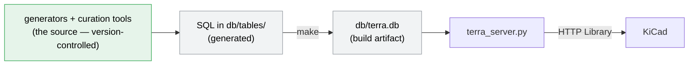

# Terra EDA Library

## What Terra is

Terra is an HTTP-served database component library for KiCad based on parts that
are fully generated by scripts.  Each part is a real, fully-specified, orderable
part — a concrete MPN with its datasheet, parameters, symbol, and footprint — so
that schematic capture places parts that are complete from the start.

Terra aims to be the fully-specified counterpart to KiCad's shipped symbol and
footprint libraries. Those provide the drawing; Terra adds the manufacturer
identity, datasheet (in the case of generic parts), and parameters that make a
part orderable and BOM-ready. Because each part is produced by tools — from
KiCad's libraries and from datasheet and parametric sources — Terra is a
*generator* whose output is version-controlled, not a database you populate by
editing.

## How it fits together



The canonical form of the library is the set of scripts and assets under
`db/tables/*`. These scripts generate SQL table entries that are compiled into
the live database, which is then accessed via the HTTP server.

Only the scripts and assets are version controlled. The SQL files and database
are generated objects, always consistent and reproducible given the same scripts
and assets. Every part has a script — even bespoke one-offs — so that schema
changes and convention switches (US vs. EU symbol styles, for example) are
configuration changes followed by a rebuild, never mass edits. No SQL is tracked
in git; a few legacy parts still live as tracked SQL files, and those are slated
for migration to scripts as well.

The database is a SQLite database served over HTTP, which yields a number of advantages:

- No ODBC driver is needed.  Much simpler operating-system setup and no driver dependency.
- No per-table configuration is needed. Much simpler and less tedious KiCad
  configuration.
- New additions to the library are automatically picked up without extra configuration.
- HTTP libs are lazily loaded which means that your 'add-part' dialog pops up
  quickly, regardless of how large the library grows.

The name "Terra EDA Library" was chosen to contrast with the (excellent)
[Celestial Altium Library](https://altiumlibrary.com/). That library is
meticulously hand curated with hundreds of thousands of parts. The assets are
[released on GitHub](https://github.com/issus/altium-library) but the
database--the crucial part--is closed, in the cloud, gated requiring signup and
authentication, with complicated local setup. The symbols, while extensive,
clash with the KiCad symbol style, and do not particularly enhance the Altium
schematic appearance either.

By contrast, Terra runs entirely on your local system, is grounded in the
existing KiCad symbols and footprints, is open to inspection, modification,
correction, and enhancement, and invites you to roll up your sleeves and dig in.

## Using the library

To use Terra as a consumer — build it, serve it, and select parts in KiCad.

### Prerequisites

- KiCad 7.0+ (9.0+ recommended)
- Python 3 and [uv](https://docs.astral.sh/uv/)
- make

### Build and serve

```bash
git clone https://github.com/dfnr2/terra-eda-library.git
cd terra-eda-library

make            # build db/terra.db + terra.kicad_dbl from the SQL
make httplib    # write terra.kicad_httplib (one-time)
make serve      # serve the library at http://127.0.0.1:8361/
```

`make serve` runs in the foreground; leave it running while you use KiCad.

### Connect KiCad

1. **Preferences → Configure Paths…** — add `TERRA_EDA_LIB` = the repo path, then
   restart KiCad.
2. **Preferences → Manage Symbol Libraries… → Global Libraries** — **Add**, and
   point the path at `${TERRA_EDA_LIB}/terra.kicad_httplib`. Give it a nickname,
   e.g. `terra`.
3. Press **A** in a schematic — the Terra categories appear, and parts drop in
   fully specified.

The server must be running for the library to load.

## Working on the library

Parts are added and changed by **running or writing generators and curation
tools** — never by editing the SQL or the database by hand. This is deliberate.
The scripts enforce the invariants that make the library coherent: above all that
each part's `part_locator` (the canonical key used to find substitutes) is the
computed value, and that metadata is complete. A hand edit silently bypasses
those guarantees — exactly the kind of drift the generated workflow exists to
prevent.

The shape of that work:

- Generate a series from a datasheet (the resistor and capacitor generators are
  the model), or seed parts from KiCad's shipped symbols — see [PLAN.md](PLAN.md)
  for the approach and [PROCESSES.md](PROCESSES.md) for the commands.
- Rebuild with `make`, check round-trip consistency with `make verify`, and
  review the diff of the scripts and assets before committing.

## Documentation

- **[PLAN.md](PLAN.md)** — Terra's intention and approach, and the go-forward
  plan.
- **[PROCESSES.md](PROCESSES.md)** — the build, generation, and curation
  processes in detail.
- **[specs/100-httplib-server-spec/server-spec.md](specs/100-httplib-server-spec/server-spec.md)**
  — the HTTP server's API, exactly as implemented.

## License

[Add your license information here]
